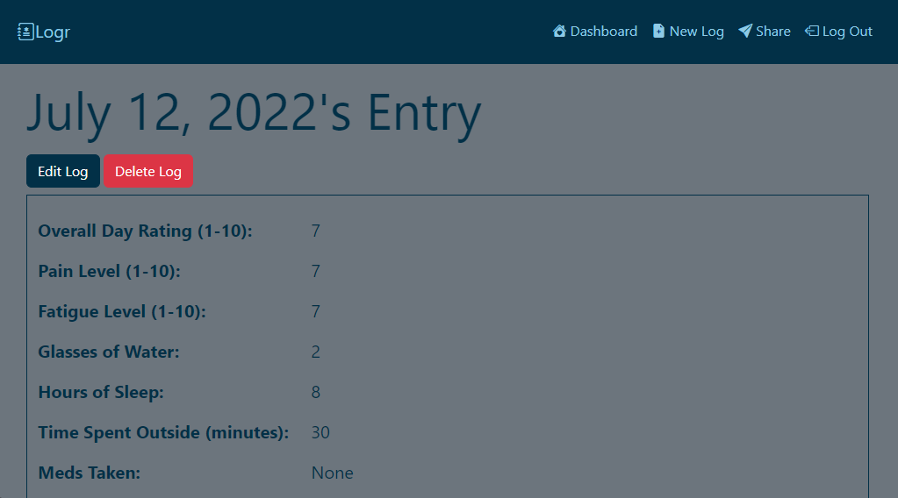

# Logr
This is the refactored version of Logr, see original project [here](https://github.com/krismally/symptom-tracker). Logr is a Full-Stack CRUD app that gives users the ability to track a variety of symptoms by filling out a Daily Log. The Daily Log is designed to be thorough while remaining easy to complete. Logr's UI/UX design prioritizes accessibility and responsiveness with large text and icons for readability, user-friendly form inputs, and a consistent, well-thought out structure.

## Motivation
I came up with the idea for Logr after I had created a Daily Symptom Log to better track and manage my Fibromyalgia. An issue many people with chronic illnesses have (including myself) is remembering all of the triggers, symptoms, and general chaos each day includes. This makes it harder to manage your symptoms and almost impossible to fully explain them to doctors. Logr is a solution to that!

## Table of Contents
1. [Technologies Used](#technologies-used)
2. [Refactoring](#refactoring)
3. [Getting Started](#getting-started)
4. [Current App](#current-app)
5. [Credits](#credits)
6. [Future Enhancements](#future-enhancements)

## Technologies Used
- Django
- Python
- PostgreSQL
- HTML5
- CSS3
- Bootstrap 5
- Bootstrap Icons

## Refactoring
The first version of Logr was built with the MEN stack. I wanted to implement user authentication and other features so I decided to refactor the codebase after learning Django! Django's enhanced security features, built-in user authentication, and it's ORM was the reason I chose to refactor Logr to the Django codebase.

## Getting Started
[Click Here to see the deployed app](https://logr-daily-symptom-tracker.herokuapp.com/)! To add a new log entry click "New Log" and fill out form details. Please note - the Share button is an empty link because it is still in development.

## Current App

## Credits
UI/UX Co-Designer - Blu Funk-Wilder - Figma

## Future Enhancements
- Users can share entries
- Users can filter their entries
- Integrate Weather API to display users weather automatically for each entry
- Users can see statistics to identify patterns over time